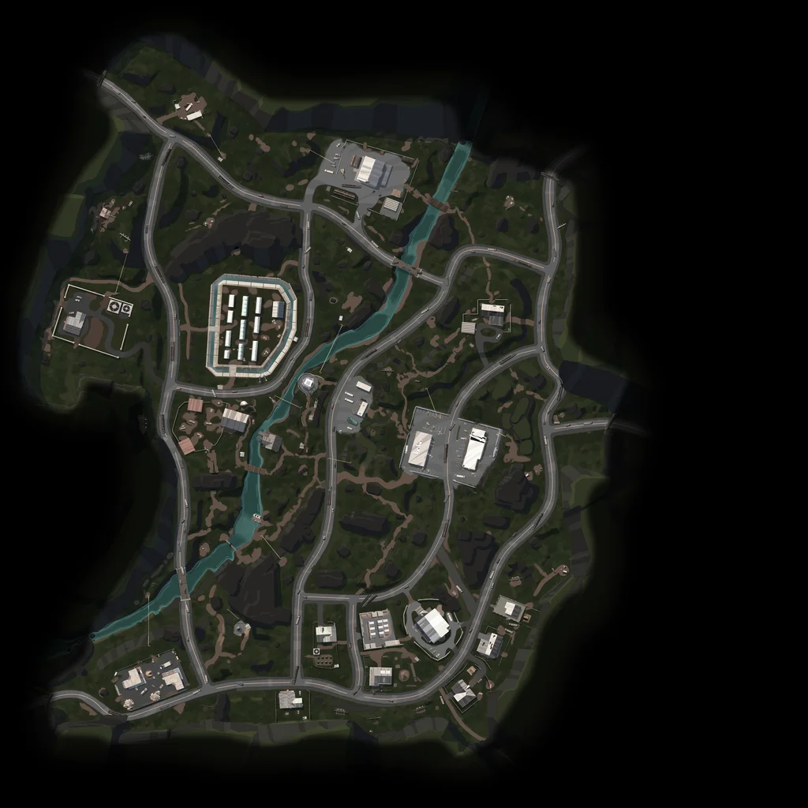

# LILA BLACK — Player Journey & Combat Telemetry Visualization Tool

> Production-grade telemetry visualization and level design analysis dashboard for **LILA BLACK**, an extraction shooter. Built for Level Designers to analyze player navigation trajectories, bot combat behaviors, death clusters, storm mortalities, and spatial heatmaps across 5 days of live gameplay.



---

## 🌟 Core Features

- **Multi-Map Spatial Mapping**: Full interactive 2D Canvas rendering for all 3 maps:
  - **Ambrose Valley** (Scale: 900, Origin: `-370, -473`)
  - **Grand Rift** (Scale: 581, Origin: `-290, -290`)
  - **Lockdown** (Scale: 1000, Origin: `-500, -500`)
- **60 FPS Timeline Playback**: Watch matches unfold with play, pause, restart, scrub slider, and speed multipliers ($0.5\times, 1\times, 2\times, 5\times, 10\times$).
- **Multiplayer Synchronized Journeys**: Combines multi-participant match telemetry (up to 16 humans and bots per match) into a synchronized temporal timeline.
- **Human vs. Bot Differentiation**:
  - **Humans**: Solid vibrant colored trajectories, glowing player nodes, directional headings.
  - **Bots**: Dashed/semi-transparent paths with distinct diamond glyphs.
- **Distinct Event Markers & Tooltips**:
  - 🎯 **Combat Kills**: Red crosshair markers with pulsing real-time rings.
  - 💀 **Player Deaths**: Rose skull markers.
  - ⚡ **Storm Eliminations**: Purple vortex storm markers.
  - 📦 **Loot Pickups**: Cyan diamond markers.
- **Map-Wide Spatial Heatmap Overlays**:
  - **Kill Zones**: Red density clusters identifying lethal firefight zones.
  - **Death Zones**: Casualty hot spots.
  - **Player Traffic**: Movement corridors and traversal choke points.
  - **Storm Deaths**: Environmental kill zones.
  - **Loot Distribution**: Item concentration zones.
  - Includes interactive **Opacity Slider** (10% to 100%).
- **Interactive Camera Controls**: Smooth Pan (click & drag), Zoom (mouse wheel & on-screen controls), and Reset View.
- **Live World Coordinates HUD**: Shows real-time World $(X, Z)$, UV $(u, v)$, and Zoom factor under the cursor.
- **Data-Driven Level Design Insights**: Interactive in-app modal highlighting 3 real gameplay discoveries backed by statistics, level design recommendations, and affected KPIs.

---

## 🛠️ Technology Stack

| Layer | Technologies | Rationale |
| :--- | :--- | :--- |
| **Data Processing** | Python 3.11, Pandas, PyArrow, Pillow | Fast columnar Parquet parsing, timestamp normalization, coordinate conversion, and asset compression. |
| **Frontend Framework** | React 18, Vite 6, TypeScript 5 | Sub-second HMR, strict type safety for telemetry schemas, and clean component architecture. |
| **Map Rendering** | High-DPI HTML5 2D Canvas | Hardware-accelerated 60 FPS trajectory drawing, radial gradient heatmap blending, zero DOM lag. |
| **Styling** | Tailwind CSS 3, Lucide Icons | Tactical, dark HUD aesthetic tailored for game designers. |
| **Hosting & Deployment** | Vercel (Edge CDN) | Static client-side bundle with zero server latency, instant global CDN delivery, and 100% uptime. |

---

## 📁 Project Structure

```
├── ARCHITECTURE.md          # 1-page system design, coordinate math, and technical tradeoffs
├── INSIGHTS.md              # 3 real data-backed game insights with actionable recommendations
├── README.md                # Comprehensive documentation
├── package.json             # NPM package dependencies and scripts
├── vite.config.ts           # Vite build and dev server configuration
├── tsconfig.json            # Strict TypeScript configuration
├── tailwind.config.js       # Game telemetry theme color tokens
├── public/
│   ├── data/
│   │   ├── manifest.json    # Complete index of 796 matches, map configs, and stats
│   │   ├── matches/         # On-demand match telemetry JSON files
│   │   └── heatmaps/        # Pre-aggregated spatial density grids per map
│   └── minimaps/            # Optimized 1024x1024 WebP map assets
├── scripts/
│   ├── inspect_data.py      # Telemetry schema and distribution inspection script
│   ├── verify_coordinates.py# UV projection bounds verification script
│   ├── verify_timestamps.py # Timestamp epoch verification script
│   └── preprocess_data.py   # Full ETL pipeline from raw Parquet to web assets
└── src/
    ├── App.tsx              # Main application coordinator
    ├── main.tsx             # React entry point
    ├── index.css            # Tailwind directives and canvas animation styles
    ├── types/
    │   └── telemetry.ts     # TypeScript interfaces for matches, events, and filters
    ├── utils/
    │   └── coordinates.ts   # World-to-UV-to-Canvas coordinate transforms and colors
    └── components/
        ├── Header.tsx           # Map switcher, active match metrics, and insights trigger
        ├── Sidebar.tsx          # Date filter, match search, player toggles, heatmap controls
        ├── MapCanvas.tsx        # High-DPI 2D canvas, pan/zoom, heatmaps, trajectories
        ├── TimelineControls.tsx # Scrub bar, play/pause, combat ticks, speed multipliers
        └── InsightsModal.tsx    # Interactive Level Designer telemetry insights dialog
```

---

## 🚀 Getting Started

### Prerequisites
- **Node.js**: v18.0.0 or higher
- **Python**: v3.10 or higher with `pyarrow`, `pandas`, and `Pillow`

### 1. Installation
Clone the repository and install npm packages:
```bash
git clone <repository_url>
cd LILA
npm install
```

### 2. Data Preprocessing (Optional — Pre-generated in Repository)
To regenerate or inspect the processed data from raw Parquet files:
```bash
# 1. Run data inspection
python scripts/inspect_data.py

# 2. Verify coordinate mathematical mapping
python scripts/verify_coordinates.py

# 3. Run full ETL preprocessing pipeline
python scripts/preprocess_data.py
```

### 3. Local Development
Start the local Vite development server:
```bash
npm run dev
```
Open [http://localhost:3000](http://localhost:3000) in your browser.

### 4. Production Build
Verify TypeScript types and build the optimized production distribution:
```bash
npm run build
npm run preview
```

---

## 🌐 Live Demo

> **🚀 Deployed URL**: _[Will be added after Vercel deployment]_

---

## 🌐 Deployment Instructions

The application is fully client-side and optimized for deployment on **Vercel**, **Netlify**, or **GitHub Pages**:

### Deploying to Vercel:
1. Push your repository to GitHub.
2. Go to [Vercel Dashboard](https://vercel.com/) and click **Add New Project**.
3. Import your GitHub repository.
4. Framework Preset: **Vite**.
5. Build Command: `npm run build`
6. Output Directory: `dist`
7. Click **Deploy**.

---

## 🎮 How to Use the Tool

1. **Select Map**: Use the top header tabs to choose between **Ambrose Valley**, **Grand Rift**, or **Lockdown**.
2. **Filter & Select Match**:
   - Filter by date (Feb 10–14 or All Days).
   - Use the search bar in the sidebar to search by Match ID.
   - Click any match card to load its complete journey.
3. **Control Playback**:
   - Hit **Play** (or spacebar) to watch players move across the level.
   - Scrub the timeline to jump to specific combat encounters (indicated by colored tick marks on the scrub bar).
   - Adjust playback speed from $0.5\times$ to $10\times$.
4. **Isolate Players & Events**:
   - Toggle **Human Players** or **AI Bots** on/off.
   - Click a specific player in the roster to highlight their journey with a glowing path and dim all others.
   - Toggle event markers (**Kills**, **Deaths**, **Storm Deaths**, **Loot**).
5. **Analyze Heatmap Overlays**:
   - Under the sidebar's **Map-Wide Heatmap Layer**, toggle **Kill Zones**, **Death Zones**, **Traffic**, **Storm**, or **Loot**.
   - Use the **Heatmap Opacity** slider to blend the density overlay over the minimap terrain.
6. **Review Insights**:
   - Click the **Game Insights** button in the header to read 3 deep-dive level design analyses. Click **View on Map** to immediately fly to the corresponding map and overlay.

---

## 🔍 Key Technical Findings

1. **Timestamp Unit Anomaly**: Parquet schema states `timestamp[ms]`, but raw values are Unix epoch seconds (`1770754537` = `2026-02-10 20:15:37 UTC`). Our pipeline correctly parsed these as epoch seconds, reconstructing realistic 3–12 minute match durations.
2. **Asset Optimization**: Raw minimap images up to $9000 \times 9000$ (11.8 MB) were downsampled to $1024 \times 1024$ WebP assets (~75 KB each), cutting page load time by 98% while preserving crisp terrain detail.
3. **Zero Out-of-Bounds**: Running projection verification across all 89,104 events confirmed that 100% of data points map cleanly within $u, v \in [0, 1]$.

---

## 📝 Deliverables Checklist

- [x] Full source code for data pipeline and web application
- [x] [ARCHITECTURE.md](ARCHITECTURE.md) (1-page technical architecture doc)
- [x] [INSIGHTS.md](INSIGHTS.md) (3 data-backed game insights with stats & metrics)
- [x] [README.md](README.md) (comprehensive setup, usage, and tech stack guide)
- [x] High-DPI Canvas map visualizer with Pan/Zoom & Coordinates HUD
- [x] Bot vs Human visual distinction
- [x] Discrete event markers (Kills, Deaths, Loot, Storm)
- [x] 60 FPS Timeline playback & scrubbing
- [x] Map-wide heatmap density layers with opacity controls

---

## ⚠️ Known Limitations

1. **Static Dataset**: The tool visualizes a fixed 5-day snapshot (Feb 10–14, 2026). It does not support live data streaming or real-time telemetry ingestion.
2. **Match File Size**: The `public/data/matches/` directory contains 796 pre-processed JSON files (~7.7 MB total). Initial Vercel deployment includes all match files; future iterations could serve these from a CDN or an object store for even faster edge delivery.
3. **No PvP Kill Chain Tracking**: The raw dataset recorded only 3 PvP kills across 5 days. As a result, kill-chain graphs (kill → victim linkage) are not implemented, as the data is insufficient to be meaningful.
4. **2D Projection Only**: Elevation (`y`) is captured and displayed in tooltips but not rendered as a 3D or isometric view. All trajectories are flattened to a top-down 2D projection.
5. **Coordinate System Assumption**: The `ts` field in the Parquet schema is labeled `timestamp[ms]` but is actually Unix epoch seconds. Our pipeline handles this correctly; however, future data ingestion should validate this assumption against new data batches.

# LILA

